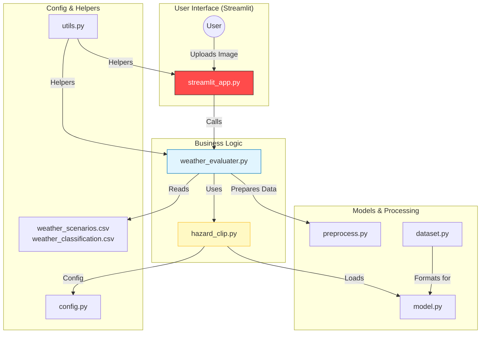
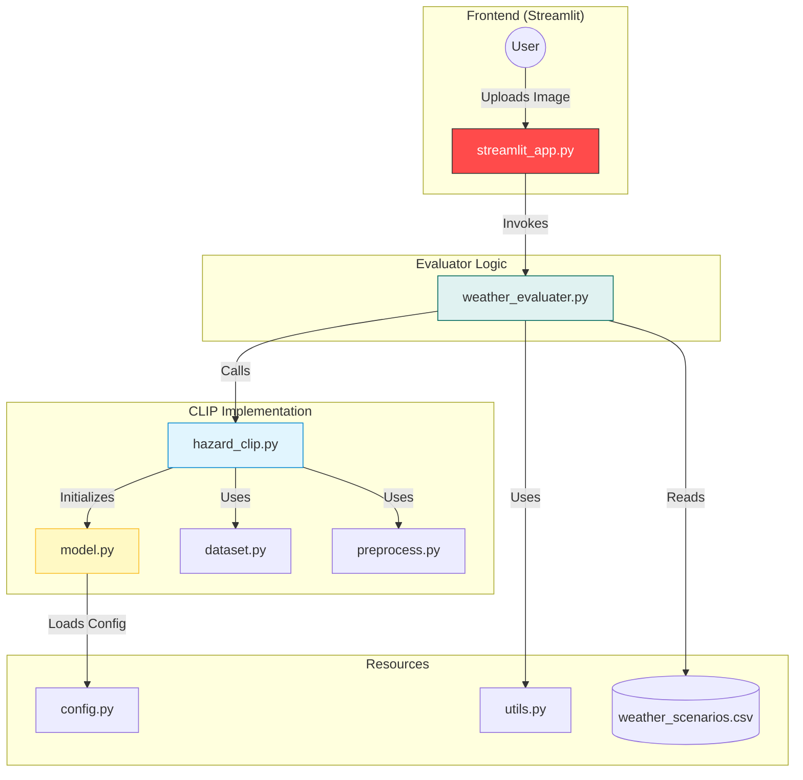

\# Rail Track Segmentation Using DINOv2

Computer Vision project for automated rail track segmentation using foundation models.

\## Project Overview

\*\*Goal:\*\* Develop a functional prototype demonstrating rail track segmentation using DINOv2 foundation model.

\### Features

\- Rail track segmentation using pretrained DINOv2

\- Object detection and counting (tracks, trains, obstacles)

\- Interactive Streamlit web interface

\- Future: Digital twin with georeferenced segmentation (OSDaR23 dataset)

---

\## 🗂️ Dataset

\*\*Primary:\*\* \[RailSem19](https://wilddash.cc/railsem19) - Rail scene segmentation dataset  

\*\*Secondary:\*\* \[OSDaR23](https://github.com/RailAI/osdar23) - Railway dataset with GPS metadata

---

\## 🛠️ Tech Stack

\- \*\*Model:\*\* DINOv2 (Meta AI) - Vision foundation model

\- \*\*Framework:\*\* PyTorch

\- \*\*UI:\*\* Streamlit

\- \*\*Visualization:\*\* Matplotlib, OpenCV

\- \*\*Package Manager:\*\* uv (fast Python package installer)

---

\## 📦 Installation

\### Prerequisites

\- Python 3.11

\- uv package manager

\### Setup

